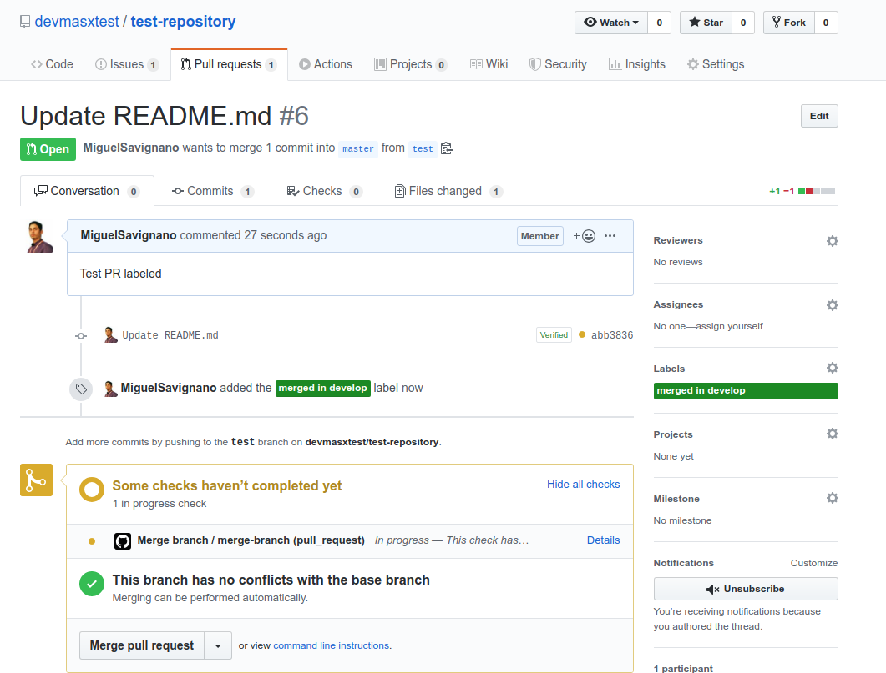

## Merge branch action

Runs a git merge in your CI.

Examples:

### Sync branches

```yaml
name: Sync multiple branches
on:
  push:
    branches:
      - '*'
jobs:
  sync-branch:
    runs-on: ubuntu-latest
    steps:
      - uses: actions/checkout@master

      - name: Merge development -> staging
        uses: devmasx/merge-branch@master
        with:
          type: now
          from_branch: development
          target_branch: staging
          github_token: ${{ github.token }}

      - name: Merge staging -> uat
        uses: devmasx/merge-branch@master
        with:
          type: now
          from_branch: staging
          target_branch: uat
          github_token: ${{ github.token }}
```

### Merge current branch

```yaml
name: Merge any release branch to uat
on:
  push:
    branches:
      - 'release/*'
jobs:
  merge-branch:
    runs-on: ubuntu-latest
    steps:
      - uses: actions/checkout@master

      - name: Merge staging -> uat
        uses: devmasx/merge-branch@master
        with:
          type: now
          target_branch: uat
          github_token: ${{ github.token }}
```

### On labeled

Merge pull request branch using GitHub labels.

When you set a label in a pull request this action can merge the pull request branch to other branch, useful for develop branch or staging environments.




```yaml
name: Merge branch with labeled
on:
  pull_request:
    types: [labeled]
jobs:
  merge-branch:
    runs-on: ubuntu-latest
    steps:
      - uses: actions/checkout@master

      - name: Merge by labeled
        uses: devmasx/merge-branch@master
        with:
          label_name: 'merged in develop'
          target_branch: 'develop'
          github_token: ${{ github.token }}
```

### Check merged branch

Assign label to pull request merged in another branch.

Run workflow on staging branch, this workflow check if the `GITHUB_SHA` have a pull request, and assign the label 'merged-in-staging' and create a check-run in the merged commit.

```yaml
name: Set label on merged branch
on:
  push:
    branches:
      - 'staging'
jobs:
  merge-branch:
    runs-on: ubuntu-latest
    steps:
      - uses: actions/checkout@master

      - name: check merge in staging
        uses: devmasx/merge-branch@v1.3.1
        with:
          type: 'merged-label'
          label_name: merged-in-staging
          github_token: ${{ github.token }}
```
